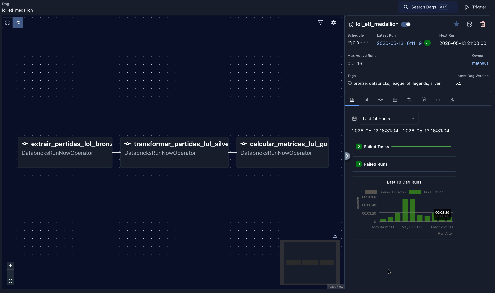
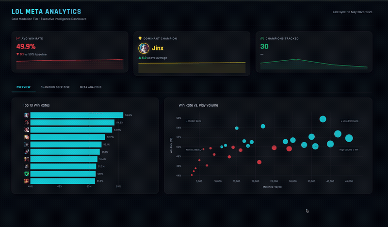
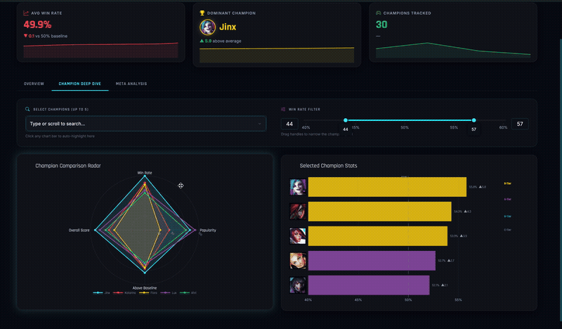
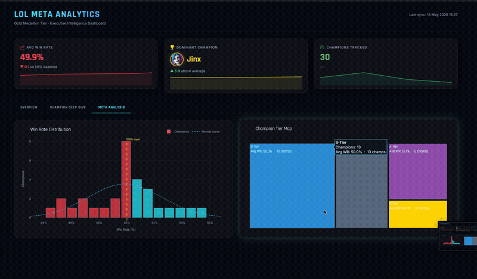

# LoL Meta Analytics

> Personal League of Legends data pipeline and analytics dashboard — from raw Riot API data to interactive champion meta insights.

---

## Dashboard Showcase



**Overview Tab**



**Champion Deep Dive**



**Meta Analysis**



---

## Architecture

```
Riot Games API
      │
      ▼
┌─────────────────────────────────────────────────────────────┐
│           Apache Airflow  (Docker Compose)                  │
│                                                             │
│  [Bronze Extraction] ──► [Silver Transformation] ──►        │
│                           [Gold Aggregations]               │
└─────────────────────────────────────────────────────────────┘
         │                       │                    │
         ▼                       ▼                    ▼
  bronze_matches_lol    silver_matches_lol   gold_champion_stats_lol
  (raw JSON strings)    (per-game rows)      (per-champion stats)
         └───────────────────────┴────────────────────┘
                                 │
                     Databricks Delta Lake
                                 │
                                 ▼
                     ┌───────────────────────┐
                     │   Dash Dashboard      │
                     │   (Plotly + DBC)      │
                     │   localhost:8050      │
                     └───────────────────────┘
```

---

## Tech Stack

| Layer | Technology |
|---|---|
| Orchestration | Apache Airflow 3.2.1 (CeleryExecutor, Docker Compose) |
| Data Processing | PySpark on Databricks (Delta Lake) |
| Data Source | Riot Games Match API v5 |
| Storage | Databricks Delta Lake (Bronze / Silver / Gold) |
| Dashboard | Dash 4.1.0 + Plotly 6.7.0 + dash-bootstrap-components |
| Backend Services | PostgreSQL 16 + Redis 7.2 (Airflow metadata & broker) |
| Container Runtime | Docker + Docker Compose |

---

## Project Structure

```
projeto-lol/
├── .env                          # Airflow settings (gitignored — see .env.example)
├── .env.example                  # Airflow env template
├── .gitignore
├── README.md
│
├── config/
│   └── airflow.cfg               # Airflow configuration
│
├── dags/
│   └── dag_lol_pipeline.py       # Daily DAG: triggers Bronze → Silver → Gold jobs
│
├── databricks/
│   ├── 1_Bronze_Extraction_LoL.py      # Riot API → raw JSON Delta table
│   ├── 2_Silver_Transformation_LoL.py  # Parse participants → clean per-game rows
│   └── 3_Gold_Aggregations_LoL.py      # Aggregate per-champion win rates & stats
│
├── infra/
│   ├── docker-compose.yaml       # Full Airflow stack (Postgres + Redis + Celery)
│   └── Dockerfile                # Dash dashboard container image
│
├── lol_analytics_dash/
│   ├── .env                      # Databricks credentials (gitignored — see .env.example)
│   ├── .env.example              # Databricks env template
│   ├── requirements.txt          # Dashboard Python dependencies
│   └── app.py                    # Interactive Dash application (3 tabs, 6 charts)
│
├── docs/
│   └── screenshots/              # Dashboard screenshots (add after first deploy)
│
├── logs/                         # Airflow runtime logs (gitignored)
└── plugins/                      # Airflow plugins directory (empty)
```

---

## Prerequisites

- [Docker Desktop](https://www.docker.com/products/docker-desktop/) or Docker Engine + Compose v2
- Python 3.13 (for local dashboard development)
- A Databricks workspace with:
  - A running SQL Warehouse
  - Three Databricks Jobs created for Bronze, Silver, and Gold scripts — named `LoL_Extraction_Bronze`, `LoL_Transformation_Silver`, and `LoL_Aggregation_Gold`
- A [Riot Games API key](https://developer.riotgames.com/) (development keys expire every 24 hours)

---

## Setup

### 1. Clone and configure environment variables

```bash
git clone <repo-url>
cd projeto-lol

# Airflow settings
cp .env.example .env
# Edit .env — set AIRFLOW_UID to your Linux UID: id -u

# Dashboard credentials
cp lol_analytics_dash/.env.example lol_analytics_dash/.env
# Edit lol_analytics_dash/.env with your Databricks connection details
```

### 2. Configure the DAG with your Databricks Job names

The DAG references Databricks Jobs by **name** (not by numeric ID), so no code changes are required — just make sure your Databricks Jobs match these exact names:

| Airflow Task | Expected Databricks Job Name |
|---|---|
| `extrair_partidas_lol_bronze` | `LoL_Extraction_Bronze` |
| `transformar_partidas_lol_silver` | `LoL_Transformation_Silver` |
| `calcular_metricas_lol_gold` | `LoL_Aggregation_Gold` |

If your jobs have different names, update the `job_name` fields in [dags/dag_lol_pipeline.py](dags/dag_lol_pipeline.py). Then add a `databricks_default` Airflow Connection via the UI (Admin → Connections) with your workspace host and personal access token.

### 3. Configure Databricks Secrets for the Riot API key

The Bronze script reads the API key from **Databricks Secrets** — nothing is hardcoded. Create the secret scope and key using the Databricks CLI before running the pipeline for the first time:

```bash
# Create the scope (once per workspace)
databricks secrets create-scope riot-api

# Store your Riot Games API key
databricks secrets put-secret riot-api developer-key --string-value "RGAPI-your-key-here"
```

The script retrieves it at runtime via:
```python
API_KEY = dbutils.secrets.get(scope="riot-api", key="developer-key")
```

### 4. Start Airflow

```bash
docker compose -f infra/docker-compose.yaml up airflow-init
docker compose -f infra/docker-compose.yaml up -d
```

Access the UI at **http://localhost:8080** (user: `airflow`, password: `airflow`).

### 5. Run the dashboard — local development

```bash
cd lol_analytics_dash
python -m venv venv && source venv/bin/activate
pip install -r requirements.txt
python app.py
```

Open **http://localhost:8050**.

### 6. Run the dashboard — Docker

```bash
# Build context must be the project root
docker build -f infra/Dockerfile -t lol-dashboard .
docker run -p 8050:8050 --env-file lol_analytics_dash/.env lol-dashboard
```

---

## Pipeline Description

| Stage | Script | Input | Output Delta Table |
|---|---|---|---|
| Bronze | `databricks/1_Bronze_Extraction_LoL.py` | Riot API Match-V5 | `bronze_matches_lol` — raw JSON strings |
| Silver | `databricks/2_Silver_Transformation_LoL.py` | `bronze_matches_lol` | `silver_matches_lol` — one row per game |
| Gold | `databricks/3_Gold_Aggregations_LoL.py` | `silver_matches_lol` | `gold_champion_stats_lol` — per-champion stats |

Airflow triggers these three Databricks Jobs in sequence once per day via `DatabricksRunNowOperator`.

---

## Environment Variables Reference

### Root `.env` — Airflow

| Variable | Required | Description |
|---|---|---|
| `AIRFLOW_UID` | Yes | Linux UID for file ownership in containers (`id -u`) |
| `_PIP_ADDITIONAL_DEPENDENCIES` | No | Extra packages installed in Airflow containers at startup |
| `FERNET_KEY` | Recommended | Stable encryption key — generate with `python -c "from cryptography.fernet import Fernet; print(Fernet.generate_key().decode())"` |

### `lol_analytics_dash/.env` — Dashboard

| Variable | Required | Description |
|---|---|---|
| `DATABRICKS_SERVER_HOSTNAME` | Yes | Databricks workspace hostname |
| `DATABRICKS_HTTP_PATH` | Yes | SQL Warehouse HTTP path |
| `DATABRICKS_ACCESS_TOKEN` | Yes | Personal access token (`dapi...`) |

---

## Engineering Integrity

Four deliberate design decisions address common pipeline reliability issues:

### 1. Secure Secrets — no hardcoded credentials
The Riot API key is fetched at runtime from Databricks Secrets (`dbutils.secrets.get`), never embedded in source code. See [Setup step 3](#3-configure-databricks-secrets-for-the-riot-api-key) for the one-time CLI setup. Development keys expire every 24 hours; rotating the secret in the vault is all that's needed — no code changes.

### 2. DAG decoupled from Job IDs
The DAG references Databricks Jobs by `job_name` instead of numeric `job_id`. This means the orchestration definition doesn't break when a job is recreated (which changes its ID) and requires no code edits between environments.

### 3. Idempotent Gold layer — MERGE instead of overwrite
`3_Gold_Aggregations_LoL.py` writes with a Delta Lake `MERGE` (upsert) rather than `mode("overwrite")`. Re-running the pipeline any number of times converges to the same correct state: existing champions are updated in-place and new ones are inserted, with no data loss or duplication.

### 4. Python UDF performance (known limitation)
`2_Silver_Transformation_LoL.py` uses a Python UDF to parse JSON, which serializes rows between the JVM and the Python interpreter. For the current data volume (≤ 20 matches per run) this is acceptable. At larger scale, the UDF should be replaced with native Spark functions (`from_json`, `get_json_object`) to eliminate the serialization overhead.

---

## Notes

- The dashboard falls back to mock data automatically if the Databricks connection fails, so it can run offline for UI development.
- Riot API development keys expire every 24 hours. Rotate them via the Databricks Secrets CLI without touching source code (see [Secure Secrets](#1-secure-secrets--no-hardcoded-credentials)).

---

## License

Personal project. All rights reserved.
